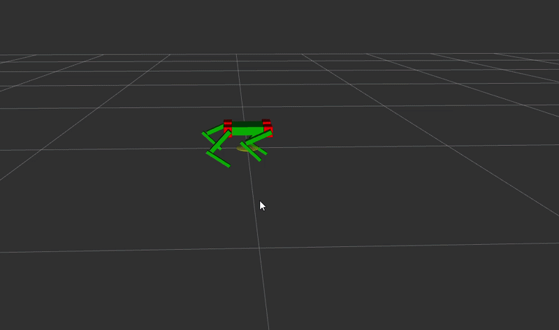

# MicroSpotAI - ROS 2 Quadruped Robot
**Status: Active Development**

A custom quadruped robot built from scratch using ROS 2, combining simulation, kinematics, hardware control, and autonomous robotics.

The goal of this project is to develop a complete robotics platform from low-level actuator control to high-level perception, localization, and navigation. Rather than relying on existing locomotion frameworks, core components such as kinematics and hardware control are implemented from scratch to deeply understand the underlying mathematics and system design principles.

---

## Project Overview
MicroSpotAI is a four-legged robot inspired by the MicroSpot platform. The project focuses on building a complete robotics stack, including:

* Quadruped locomotion
* Inverse kinematics
* Hardware-software integration
* Sensor fusion
* Localization and mapping
* Autonomous navigation

---

### Simulation Environment
Custom URDF model running in RViz and Gazebo.

**Gazebo** 
<video src="./assets/spot_gazebo_sim.mp4" controls autoplay loop muted width="100%"></video>

**RViz** 
    

## Core Features

### Inverse Kinematics

* Custom Python IK solver
* 3-DOF leg model
* Analytical solution using trigonometry and the law of cosines
* Converts target foot positions into joint angles

### Locomotion

* Custom walking gait generation
* Real-time joint trajectory generation
* Coordinated leg movement

### Hardware Integration

* Custom ROS 2 hardware bridge
* PCA9685 servo controller over I2C
* Servo offset compensation
* Mirrored leg correction
* Real robot control from ROS 2

---

## Current Progress & Roadmap

### Completed

- [x] Quadruped URDF model
- [x] Gazebo simulation
- [x] RViz visualization
- [x] Inverse kinematics solver
- [x] Walking gait generation
- [x] ROS 2 hardware interface
- [x] Physical servo control

### In Progress

- [ ] IMU integration
- [ ] State estimation
- [ ] Gait stabilization
- [ ] Hardware refinement

### Planned

- [ ] Camera integration
- [ ] LiDAR integration
- [ ] SLAM Toolbox
- [ ] Navigation2
- [ ] Autonomous navigation
- [ ] AI-based object tracking

## Hardware

- Raspberry Pi 5
- PCA9685 Servo Controller
- 12x MG996R/Miuzei Servos
- IMU 
- Camera 
- LiDAR 

## Running the Simulation

```bash
mkdir -p ~/spot_ws/src
cd ~/spot_ws/src

git clone [https://github.com/HakimHayate/microspotai.git](https://github.com/HakimHayate/microspotai.git)

cd ~/spot_ws
colcon build --symlink-install

source install/setup.bash

# Launch Rviz
ros2 launch microspot_description display.launch.py

# Launch the Controller node
ros2 run spot_controller controller_node

# Launch Gazebo
ros2 launch spot_bringup spot.launch.py