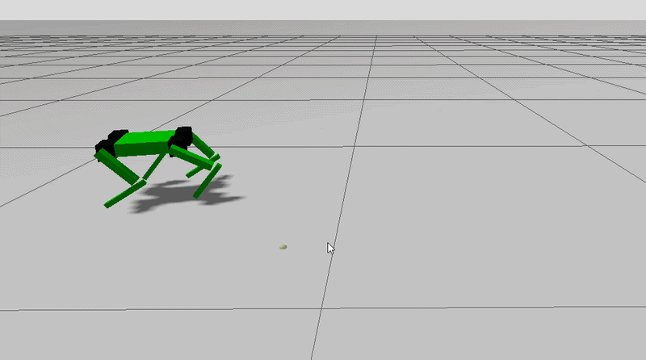

# MicroSpotAI

A custom quadruped robot built using ROS 2, combining simulation, kinematics, hardware control, and autonomous robotics.

---

## Project Overview
MicroSpotAI is a four-legged robot inspired by the MicroSpot platform. 

---

## Simulation Environment
Custom URDF model running in RViz and Gazebo.


### Gazebo



### RViz


### Hardware Integration

* Custom ROS 2 hardware bridge
* PCA9685 servo controller over I2C
* Servo offset compensation
* Mirrored leg correction
* Real robot control from ROS 2


## Hardware

- Raspberry Pi 5
- PCA9685 Servo Controller
- 12x MG996R/Miuzei Servos
- IMU 
- Camera 
- LiDAR 

## Running the Simulation

```bash
mkdir -p ~/spot_ws/src
cd ~/spot_ws/src

git clone [https://github.com/HakimHayate/microspotai.git](https://github.com/HakimHayate/microspotai.git)

cd ~/spot_ws
colcon build --symlink-install

source install/setup.bash

# Launch Rviz
ros2 launch microspot_description display.launch.py

# Launch the Controller node
ros2 run spot_controller controller_node

# Launch Gazebo
ros2 launch spot_bringup spot.launch.py